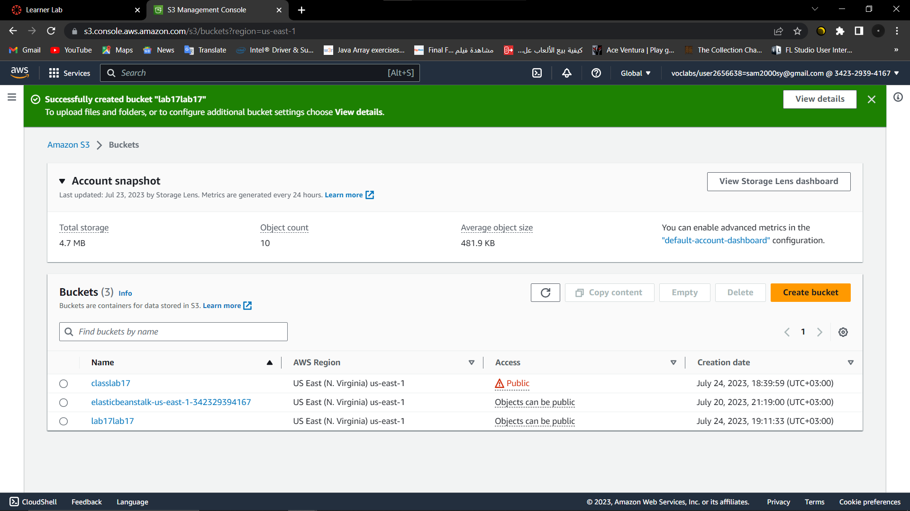
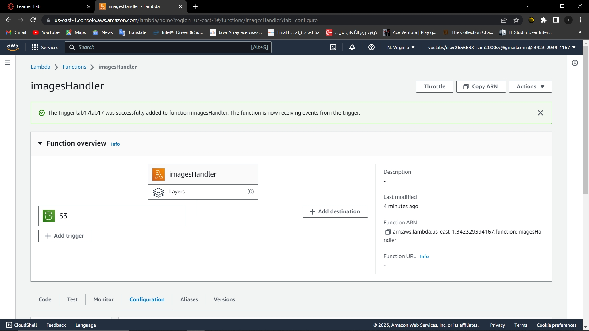
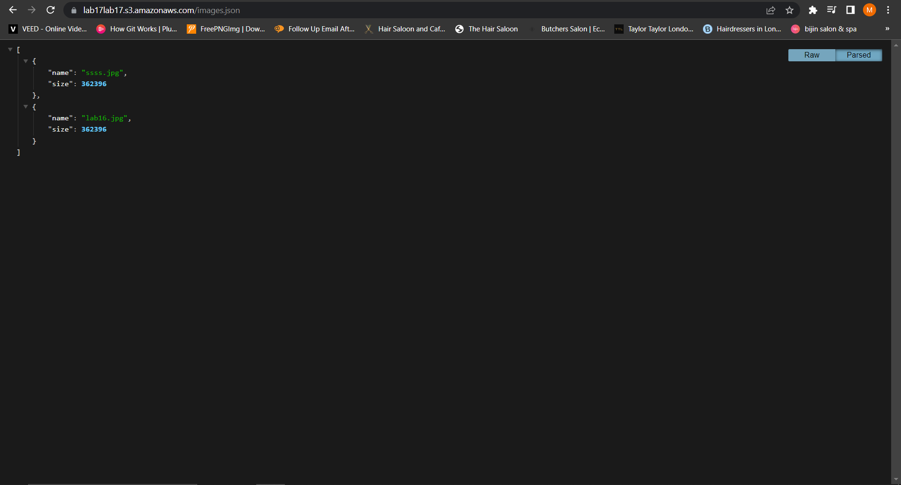

# Lab 17
## Access Control
Authors: Sham Al-Jalam, Mohammed Attallah

## URLs

* deployed application : [https://lab17lab17.s3.amazonaws.com/images.json](https://lab17lab17.s3.amazonaws.com/images.json)

*  pull request: []()

### process:
an image handler function has been created with AWS Lambda to handle every images uploaded to AWS S3, following these steps:
1. created an AWS S3 bucket
2. created a lambda function
3. added the trigger to the Lambda function
4. wrote the code to return the json file
5. uploaded the zipped code to the lambda

### Running the app:

    * Returns Object
    ```Js
    {
        [{"name":"ssss.jpg","size":362396},{"name":"lab16.jpg","size":362396}]
    }
    ```

### sceenshots




